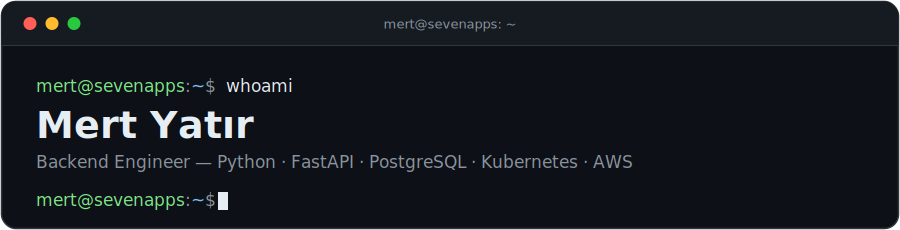

Backend engineer at [SevenApps](https://github.com/sevenappsco), building AI-powered consumer apps used by millions — FastAPI services backed by PostgreSQL and Redis, serverless GPU inference, deployed on Kubernetes/AWS.

**Find me:** [LinkedIn](https://www.linkedin.com/in/mertyatir) · [mertyatir.dev@gmail.com](mailto:mertyatir.dev@gmail.com)
